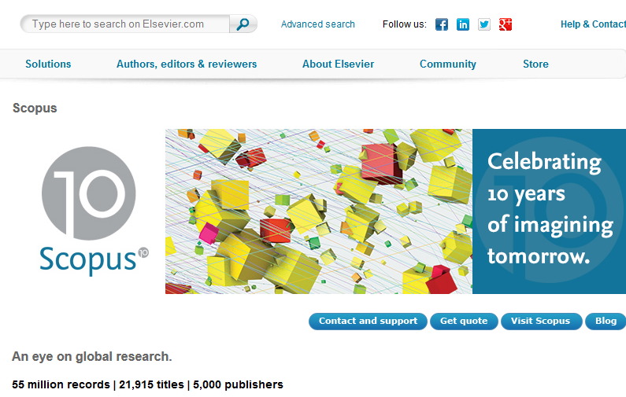
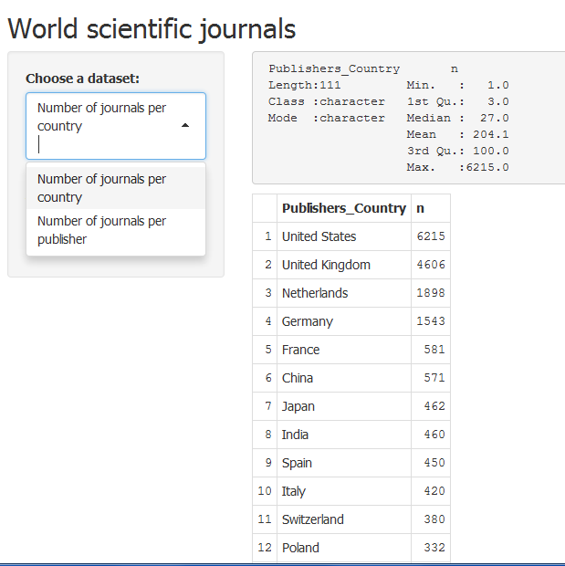
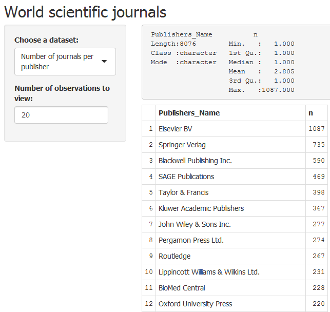
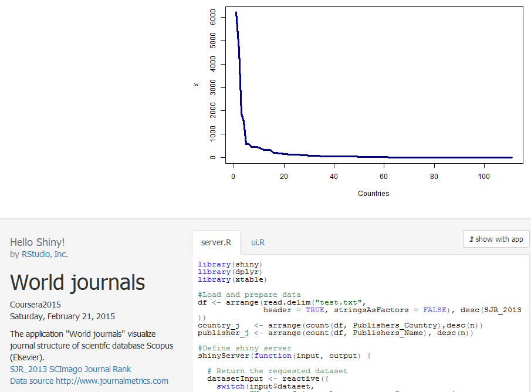

## Scopus journals structure

Application presents information about distribution of journals via countries and publishers. It gives information about main publishers and their nationality.

---.class #2

## Application's first view  
The first view presents infomation about journals via countries  

  

---.class #3

## Publishers
The second view presents infomation about journals via publishers  

  

---.class #4

## Plots
On the bottom of the page there are a plots and additional information about application

 

